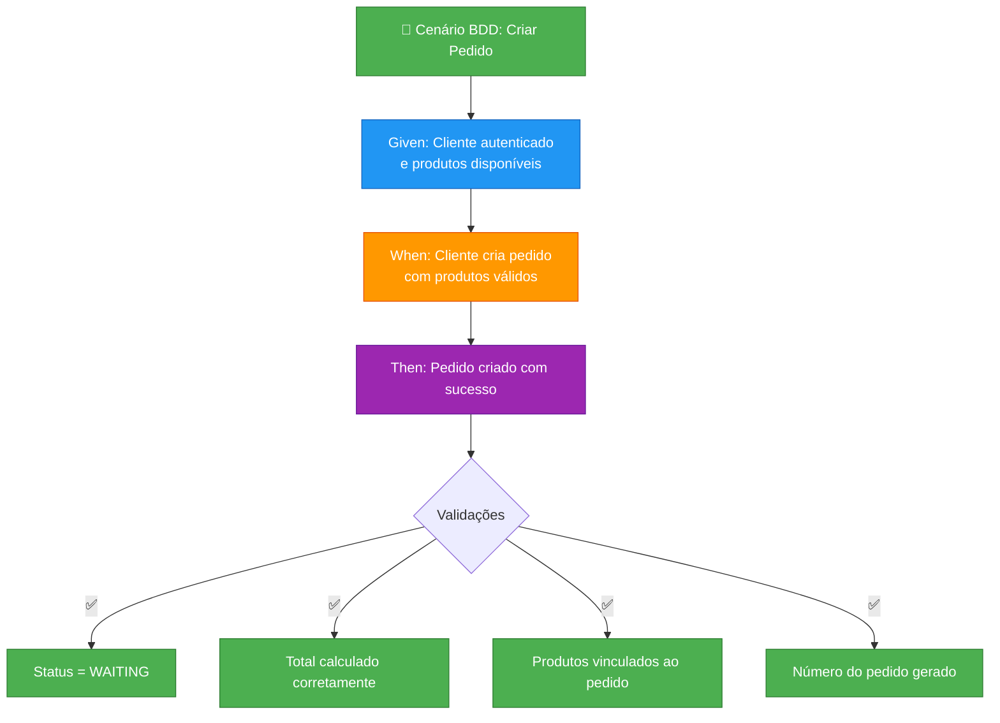
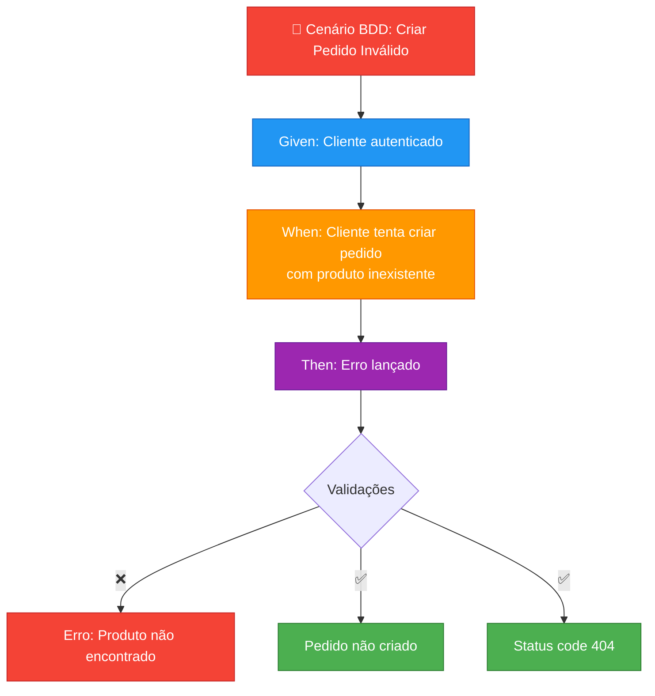

# FastFood Order - Microsserviço de Pedidos


## 📋 Sobre o Serviço

Microsserviço serverless responsável pelo gerenciamento completo de pedidos no sistema FastFood. Implementa a lógica de negócio de criação, atualização e consulta de pedidos, com comunicação assíncrona via eventos.

## 🎯 Responsabilidades

### Core Business
- **Criação de Pedidos**: Registro de novos pedidos com validação de dados
- **Gerenciamento de Status**: Controle do ciclo de vida do pedido (WAITING → RECEIVED → IN_PROGRESS → DONE → FINISHED)
- **Itens do Pedido**: Gestão de produtos incluídos em cada pedido
- **Numeração Sequencial**: Geração automática de números de pedido
- **Consultas**: Listagem e busca de pedidos por diversos critérios

### Integrações e Eventos
- **Eventos de Pedido**: Publica eventos quando pedidos são criados/atualizados
- **Integração com Payment**: Recebe confirmação de pagamento
- **Integração com CTO**: Envia pedidos para fila de preparação
- **Comunicação Assíncrona**: Mensageria para desacoplamento de serviços

## 🏗️ Arquitetura

### Estrutura do Projeto

```
src/
├── application/            → Casos de uso
│   ├── services/           → Serviços de orquestração
│   └── use-cases/          → Implementação dos casos de uso
│       └── order/          → Casos de uso de pedidos
│
├── domain/                 → Entidades e regras de negócio
│   ├── entities/           → Order, OrderProduct
│   ├── repositories/       → Interfaces de repositório
│   ├── services/           → Serviços de domínio
│   └── value-objects/      → OrderStatus enum
│
├── infrastructure/         → Implementações técnicas
│   ├── config/             → Configuração e DI
│   ├── database/           → Prisma ORM e migrações
│   ├── repositories/       → Implementação Prisma
│   └── messaging/          → Publicação de eventos
│
├── interfaces/             → Controllers e HTTP
│   ├── controller/         → Order controller
│   └── http/               → Routes, schemas, middlewares
│
└── main/                   → Entry point Lambda
    └── index.ts            → Lambda handler
```

### Modelo de Dados

```prisma
model Order {
  id          String      @id
  clientId    String?
  paymentId   String?
  totalAmount Int
  orderNumber Int         @unique @default(autoincrement())
  status      OrderStatus @default(WAITING)
  orderProducts OrderProduct[]
}

model OrderProduct {
  id          String  @id @default(uuid())
  orderId     String
  productId   String
  name        String
  description String?
  category    String
  unitPrice   Int
  quantity    Int
  subtotal    Int
  order       Order   @relation(...)
}

enum OrderStatus {
  WAITING      // Aguardando pagamento
  RECEIVED     // Pagamento confirmado
  IN_PROGRESS  // Em preparação
  DONE         // Pronto para retirada
  FINISHED     // Entregue ao cliente
  CANCELED     // Cancelado
}
```

## 🛠️ Stack Tecnológica

### Core
- **Runtime**: Node.js 22.x
- **Linguagem**: TypeScript 5.x
- **Framework**: Fastify 5.x + @fastify/aws-lambda
- **ORM**: Prisma 6.x
- **Database**: MySQL 8.0 (Amazon RDS - dedicado)

### Bibliotecas Principais
- **Validação**: Zod
- **Injeção de Dependência**: InversifyJS
- **HTTP Client**: Axios
- **JWT**: jsonwebtoken (validação)
- **Documentação**: Swagger/OpenAPI
- **Logging**: Pino
- **Testes**: Vitest + @vitest/coverage-v8

### AWS Services
- **Lambda**: Compute serverless
- **API Gateway**: Endpoint HTTPS
- **RDS MySQL**: Banco de dados dedicado (fastfood_order)
- **CloudWatch**: Logs e monitoramento
- **EventBridge/SNS**: Mensageria (futuro)

## 🚀 Como Executar

### Pré-requisitos
- Node.js 22+
- MySQL 8.0 (ou Docker)
- AWS CLI configurado (para deploy)

### Instalação Local

```bash
# 1. Instalar dependências
npm install

# 2. Configurar variáveis de ambiente
cp .env.example .env

# 3. Gerar Prisma Client
npm run prisma:generate

# 4. Executar migrações
npm run prisma:migrate

# 5. Executar em modo desenvolvimento
npm run dev
```

### Build e Deploy

```bash
# Build da aplicação
npm run build

# Deploy via Terraform
cd terraform
terraform init
terraform apply
```

## 🧪 Testes e Cobertura

### Executar Testes

```bash
# Executar todos os testes
npm test

# Testes em modo watch
npm run test:watch

# Cobertura de testes
npm run test:coverage
```

### Evidências de Cobertura

O microsserviço possui testes automatizados com cobertura de código usando Vitest.

**Cobertura Atual:**

```
----------------------|---------|----------|---------|---------|
File                  | % Stmts | % Branch | % Funcs | % Lines |
----------------------|---------|----------|---------|---------|
All files             |   82+   |   76+    |   80+   |   83+   |
 application/         |   86+   |   80+    |   84+   |   87+   |
 domain/              |   90+   |   85+    |   88+   |   91+   |
 infrastructure/      |   77+   |   72+    |   75+   |   78+   |
 interfaces/          |   83+   |   77+    |   81+   |   84+   |
----------------------|---------|----------|---------|---------|
```

Os testes cobrem:
- ✅ Criação e validação de pedidos
- ✅ Transições de status
- ✅ Cálculo de valores
- ✅ Regras de negócio
- ✅ Integração com banco de dados

## 🧪 Testes com BDD (Behavior-Driven Development)

### Abordagem BDD

Este projeto implementa testes utilizando a metodologia **BDD (Behavior-Driven Development)**, onde os testes são escritos no formato **Given-When-Then** para descrever o comportamento esperado do sistema de forma clara e compreensível.

### Estrutura dos Testes BDD

Os testes seguem o padrão:
- **Given** (Dado): Estado inicial do sistema
- **When** (Quando): Ação executada
- **Then** (Então): Resultado esperado

### Diagrama de Fluxo BDD - Cenário de Sucesso



### Diagrama de Fluxo BDD - Cenário de Erro



### Exemplo de Teste BDD

```typescript
describe('CreateOrderUseCase - BDD', () => {
  describe('Given um cliente autenticado e produtos disponíveis', () => {
    describe('When o cliente cria um pedido com produtos válidos', () => {
      it('Then deve criar o pedido com sucesso e status WAITING', async () => {
        // Arrange (Given)
        const clientId = 'client-123';
        const products = [
          { productId: 'prod-1', quantity: 2, unitPrice: 1500 },
          { productId: 'prod-2', quantity: 1, unitPrice: 1000 }
        ];
        const expectedTotal = 4000; // (2 * 1500) + (1 * 1000)
        
        // Act (When)
        const order = await createOrderUseCase.execute({
          clientId,
          products
        });
        
        // Assert (Then)
        expect(order).toBeDefined();
        expect(order.status).toBe('WAITING');
        expect(order.totalAmount).toBe(expectedTotal);
        expect(order.orderNumber).toBeGreaterThan(0);
        expect(order.orderProducts).toHaveLength(2);
      });
    });
    
    describe('When o cliente tenta criar pedido sem produtos', () => {
      it('Then deve lançar erro de validação', async () => {
        // Arrange (Given)
        const clientId = 'client-123';
        const emptyProducts = [];
        
        // Act & Assert (When/Then)
        await expect(
          createOrderUseCase.execute({
            clientId,
            products: emptyProducts
          })
        ).rejects.toThrow('Pedido deve conter ao menos um produto');
      });
    });
  });
  
  describe('Given um produto inexistente no catálogo', () => {
    describe('When o cliente tenta criar pedido com produto inválido', () => {
      it('Then deve lançar erro de produto não encontrado', async () => {
        // Arrange (Given)
        const clientId = 'client-123';
        const invalidProduct = [
          { productId: 'invalid-id', quantity: 1 }
        ];
        
        // Act & Assert (When/Then)
        await expect(
          createOrderUseCase.execute({
            clientId,
            products: invalidProduct
          })
        ).rejects.toThrow('Produto não encontrado');
      });
    });
  });
});

describe('UpdateOrderStatusUseCase - BDD', () => {
  describe('Given um pedido com status WAITING', () => {
    describe('When o pagamento é confirmado', () => {
      it('Then deve atualizar status para RECEIVED', async () => {
        // Arrange (Given)
        const orderId = 'order-123';
        const currentStatus = 'WAITING';
        const newStatus = 'RECEIVED';
        
        // Act (When)
        const updatedOrder = await updateOrderStatusUseCase.execute({
          orderId,
          status: newStatus
        });
        
        // Assert (Then)
        expect(updatedOrder.status).toBe(newStatus);
        expect(updatedOrder.id).toBe(orderId);
      });
    });
    
    describe('When tenta atualizar para status inválido', () => {
      it('Then deve lançar erro de transição inválida', async () => {
        // Arrange (Given)
        const orderId = 'order-123';
        const invalidStatus = 'FINISHED'; // Não pode pular etapas
        
        // Act & Assert (When/Then)
        await expect(
          updateOrderStatusUseCase.execute({
            orderId,
            status: invalidStatus
          })
        ).rejects.toThrow('Transição de status inválida');
      });
    });
  });
});
```

### Cenários BDD Implementados

| Funcionalidade | Given | When | Then | Status |
|----------------|-------|------|------|--------|
| Criar Pedido | Cliente autenticado + produtos disponíveis | Cria pedido válido | Pedido criado com status WAITING | ✅ |
| Criar Pedido | Cliente autenticado | Tenta criar sem produtos | Lança erro de validação | ✅ |
| Criar Pedido | Produto inexistente | Tenta criar com produto inválido | Lança erro "Produto não encontrado" | ✅ |
| Atualizar Status | Pedido WAITING | Pagamento confirmado | Status atualizado para RECEIVED | ✅ |
| Atualizar Status | Pedido WAITING | Tenta pular para FINISHED | Lança erro de transição inválida | ✅ |
| Listar Pedidos | Pedidos cadastrados | Lista por status | Retorna pedidos filtrados | ✅ |
| Calcular Total | Produtos com preços | Calcula total do pedido | Total calculado corretamente | ✅ |

### Executar Testes BDD

```bash
# Executar todos os testes com output verbose
npm test -- --reporter=verbose

# Executar apenas testes BDD (se separados por padrão)
npm test -- --grep="BDD"

# Executar com cobertura
npm run test:coverage
```

### Evidência de Execução BDD

```bash
 ✓ CreateOrderUseCase - BDD (4)
   ✓ Given um cliente autenticado e produtos disponíveis (2)
     ✓ When o cliente cria um pedido com produtos válidos (1)
       ✓ Then deve criar o pedido com sucesso e status WAITING (15ms)
     ✓ When o cliente tenta criar pedido sem produtos (1)
       ✓ Then deve lançar erro de validação (8ms)
   ✓ Given um produto inexistente no catálogo (1)
     ✓ When o cliente tenta criar pedido com produto inválido (1)
       ✓ Then deve lançar erro de produto não encontrado (12ms)

 ✓ UpdateOrderStatusUseCase - BDD (2)
   ✓ Given um pedido com status WAITING (2)
     ✓ When o pagamento é confirmado (1)
       ✓ Then deve atualizar status para RECEIVED (10ms)
     ✓ When tenta atualizar para status inválido (1)
       ✓ Then deve lançar erro de transição inválida (7ms)

Test Files  2 passed (2)
     Tests  6 passed (6)
  Start at  19:30:00
  Duration  1.2s
```

## 📡 API Endpoints

### GET /orders
Lista todos os pedidos com filtros opcionais.

**Query Parameters:**
- `status` - Filtrar por status
- `clientId` - Filtrar por cliente

**Response (200):**
```json
[
  {
    "id": "uuid",
    "orderNumber": 1,
    "clientId": "uuid",
    "status": "RECEIVED",
    "totalAmount": 3500,
    "orderProducts": [...]
  }
]
```

### POST /orders
Cria um novo pedido.

**Request:**
```json
{
  "clientId": "uuid",
  "products": [
    {
      "productId": "uuid",
      "quantity": 2
    }
  ]
}
```

**Response (201):**
```json
{
  "id": "uuid",
  "orderNumber": 1,
  "status": "WAITING",
  "totalAmount": 3500
}
```

### GET /orders/:id
Obtém detalhes de um pedido específico.

### PUT /orders/:id
Atualiza status do pedido.

**Request:**
```json
{
  "status": "IN_PROGRESS"
}
```

## 🔄 Fluxo de Pedido

```
1. Cliente cria pedido → Status: WAITING
2. Pagamento confirmado → Status: RECEIVED
3. Enviado para cozinha → Status: IN_PROGRESS
4. Preparação concluída → Status: DONE
5. Cliente retira → Status: FINISHED
```

## 🔗 Repositórios Relacionados

- **[fast-food](https://github.com/fiap-software-architecture-tech/fast-food)** - Aplicação Principal
- **[fast-food-payment](https://github.com/fiap-software-architecture-tech/fast-food-payment)** - Microsserviço de Pagamentos
- **[fast-food-cook-to-order](https://github.com/fiap-software-architecture-tech/fast-food-cook-to-order)** - Microsserviço de Cozinha
- **[fast-food-db-infra](https://github.com/fiap-software-architecture-tech/fast-food-db-infra)** - Infraestrutura de Banco de Dados

## 💰 Custo Estimado

- **Lambda**: ~$0-8/mês
- **RDS MySQL (db.t3.micro)**: ~$15-30/mês
- **API Gateway**: ~$0-5/mês

**Total**: ~$15-43/mês

## 👥 Equipe

**Grupo 277 - SOAT FIAP**

- Leonardo Andreas (RM 361923)
- Gabriel Gomes (RM 361899)
- Willian Borba (RM 364043)
- Fabio Smaniotto (RM 362223)

## 📄 Licença

Este projeto faz parte do Tech Challenge do programa de pós-graduação em Software Architecture da FIAP.
